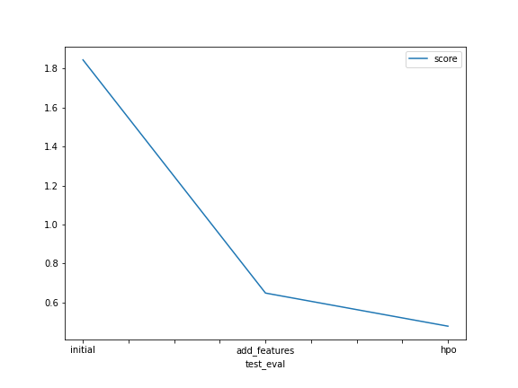

# Report: Predict Bike Sharing Demand with AutoGluon Solution
#### Pramuditha Aravinda

## Initial Training
### What did you realize when you tried to submit your predictions? What changes were needed to the output of the predictor to submit your results?
When submitting the predictions, it's necessary to observe if predictions are within the valid ranges. In this case any negative values are invalid and need to be changed accordingly. However, all values predicted by the model were positive anyway.

### What was the top ranked model that performed?
Top ranked model that performed best according to rmse metric was `WeightedEnsemble_L3`

## Exploratory data analysis and feature creation
### What did the exploratory analysis find and how did you add additional features?
As part of exploratory analysis (EDA) I have explored data by visualization of some plots. From that I observed that:

1. Some features [temp, atemp, humidity, windspeed] were nearly distributed.
2. Some features had only two possible values [holiday, workingday]
3. Some features were categorical [season, weather]

Based on the above observations, I followed the notebook instructions to split the datetime feature into month day and hour fields and also converted season and weather features into categorical features.

### How much better did your model perform after adding additional features and why do you think that is?
After adding additional features, model training score improved from -52.556431 to -33.627271. At the same time, its kaggle score improved from 1.84484 to 0.64809.

This improvement was due to the hour feature giving a better indication of the time of the day when bike share demand rises and falls. Making categorical features should also have contributed considerably for models to better understand the non-linear relationships between categorical features and bike share demand.

## Hyper parameter tuning
### How much better did your model perform after trying different hyper parameters?
Model training accuracy slighly improved from -33.627271 to -33.358842 after applying hyperparameter optimization. However, kaggle score improved considerably from 0.64809 to 0.47806 due to hpo.

This could be because the hyperparameter optimization used focuses on tree-based models that were used in already best performing ensemble technique and if we try to optimize it further, we might end up overfitting it.

### If you were given more time with this dataset, where do you think you would spend more time?
Given more time I would also reduce the dimensionality of the data set by removing redundant features from the pairs identified through correlation of the features.

### Create a table with the models you ran, the hyperparameters modified, and the kaggle score.
|model|hpo1|hpo2|hpo3|score|
|--|--|--|--|--|
|initial|'default'|'default'|'default'|1.84484|
|add_features|'default'|'default'|'default'|0.64809|
|hpo|GBM (LightGBM) : {num_boost_round: [lower=100, upper=200, default=100], num_leaves:[lower=21, upper=51, default=31]} applying random search with 5 trials|CAT (CatBoost) : {depth : [lower=6, upper=10]} applying random search with 5 trials|XGB (XGBoost): {max_depth : [lower=6, upper=10, default=6]} applying random search with 5 trials|0.47806|

### Create a line plot showing the top model score for the three (or more) training runs during the project.

### Create a line plot showing the top kaggle score for the three (or more) prediction submissions during the project.

## Summary
In summary, this exercise showcases how important it is to perform exploratory data analysis on any given dataset before applying any model training. Then based on the results found during the EDA, feature engineering can be applied to produce a good set of data for the machine learning models.

Additionally, hyperparameter tuning also plays a critical role in getting the best results out of the models trained.
